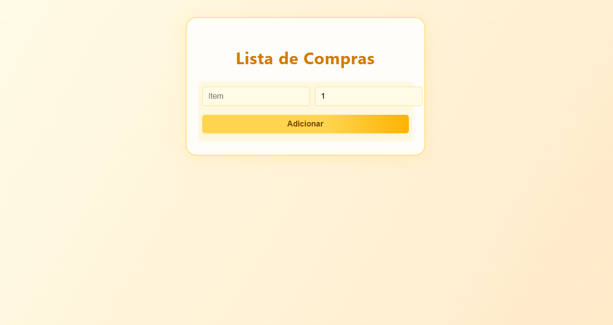
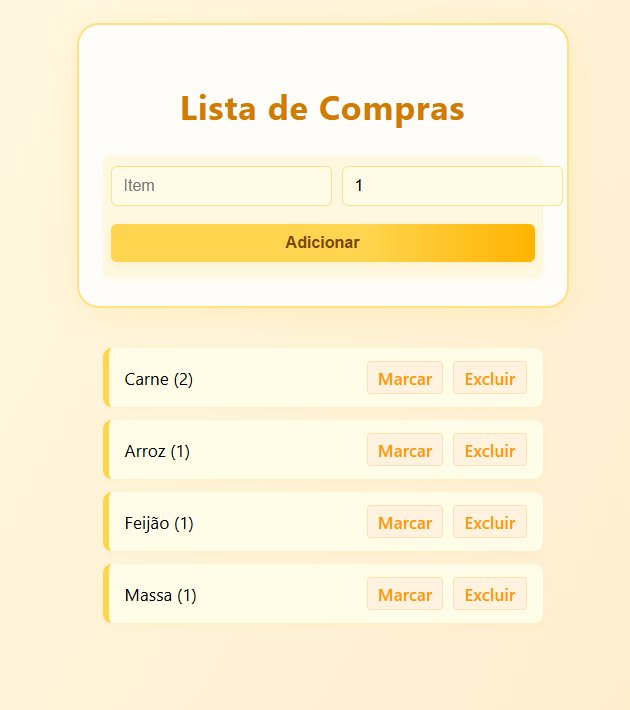
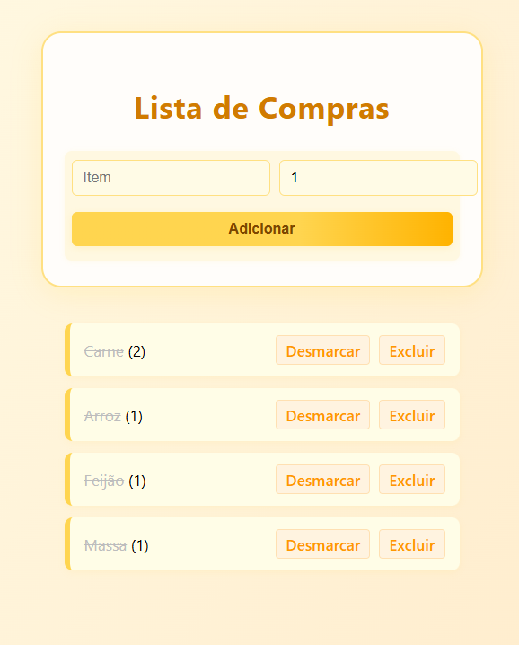

# Lista de Compras – Aplicação Web em PHP

Aplicação web desenvolvida para otimizar o processo de organização de compras do dia a dia, substituindo listas manuais por uma solução simples, rápida e persistente.

O sistema permite gerenciar itens de forma prática, garantindo controle visual do que já foi comprado e do que ainda falta, com foco em usabilidade e desempenho no backend.

---

## Funcionalidades

- Cadastro de itens com nome e quantidade
- Marcação de itens como comprados / não comprados
- Remoção de itens da lista
- Persistência de dados em banco relacional
- Atualização em tempo real via fluxo HTTP padrão (POST/Redirect/GET)

---

## 🛠 Tecnologias Utilizadas

- **PHP**
- **MySQL**
- **PDO (Prepared Statements)**
- HTML semântico
- CSS3

---

## 🧠 Decisões Técnicas

- Utilização de **PDO com prepared statements** para segurança contra SQL Injection
- Separação de responsabilidades (configuração, acesso a dados e camada de apresentação)
- Lógica de negócio centralizada em camada de repositório
- Estrutura preparada para migração futura para frameworks como Laravel

---

## 🎯 Objetivo do Projeto

Demonstrar domínio dos fundamentos de backend em PHP, incluindo:

- Comunicação com banco de dados
- Organização de código
- Regras de negócio
- Fluxo completo de requisições HTTP

A aplicação resolve um problema real e serve como base para evoluções futuras, como autenticação de usuários, múltiplas listas e versionamento de dados.

---

## 📸 Screenshots

### Tela inicial

### Item adicionado

### Item marcado como comprado

